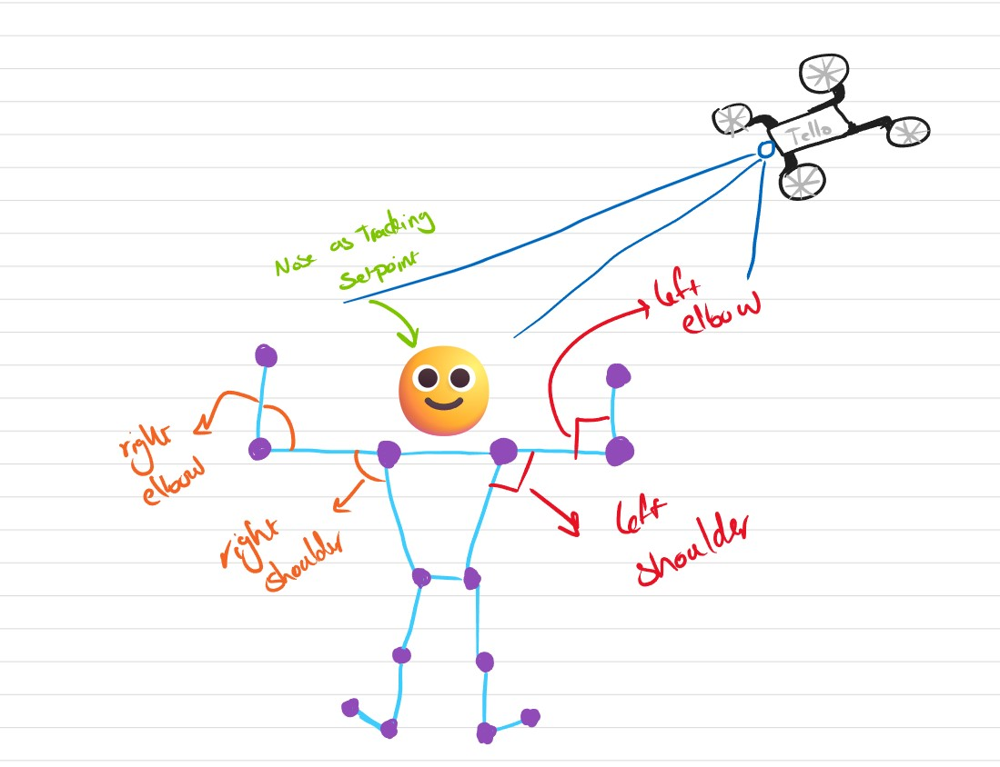

# **Pose Ordered Tello**

This is a simple implementation of Pose Estimataion Tree for sending command to a drone based on that..

### The code contains of 3 main parts:
1. Pose Estimation
2. Body Tracking
3. And some other actions for Sending Commands for the Tello Drone!

### The Commands Part Contains of:
1. Active Track
2. Forward Movement
3. Backward Movement
4. Left Movement
5. Right Movement
6. Flipping Backward
7. Taking a Snapshot
8. Land
   

### For the Active Track Part:
2 PID Controllers are applied for the Z and the Yaw Axis to have the Person in the Middle of the Frame!

### For the Pose Detection:
1. Body joints where detected using googles Mediapipe Framework
2. Angles of the elbows and shoulders for both right and left hands are being detected
3. Based on the given angles each of the poses are getting detected
4. Based on that the commands are bieng sent to the Quadcoter
5. After Execution of each command, 50 frames of images are being ignored till the next command arises!